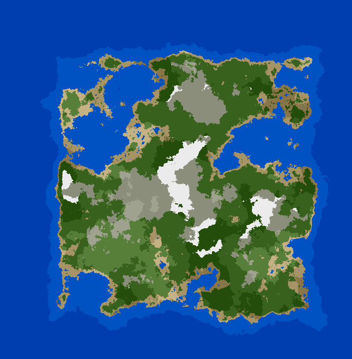
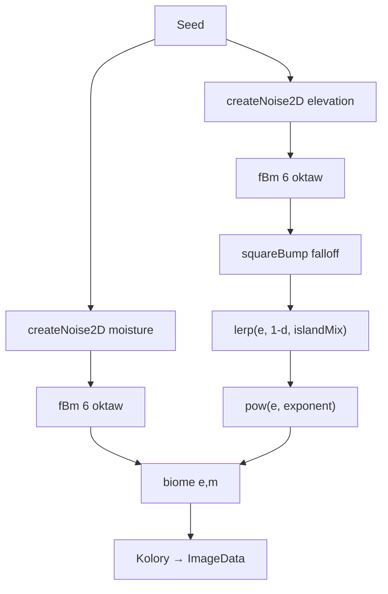
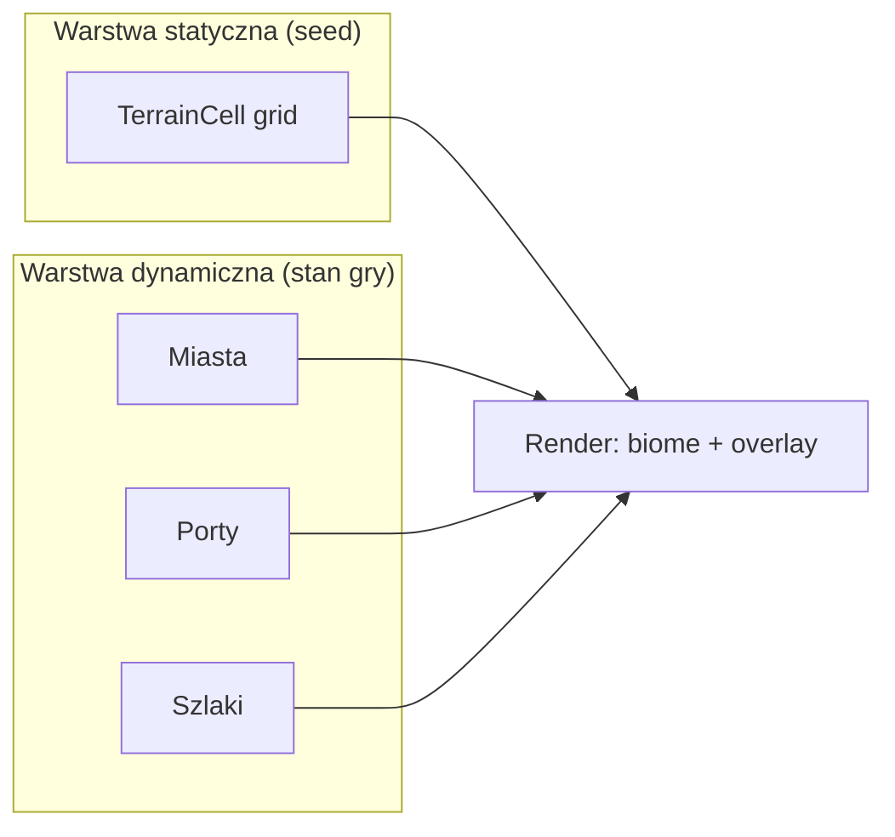

# Generator mapy wyspowej — Simplex Noise

Przewodnik po uzyskaniu efektu jak w [Procedural Map Generator](https://codesandbox.io/p/sandbox/procedural-map-generator-tsu2c) (Luca Tabone): wyspa na oceanie, plaże, lasy, góry ze śniegiem — w **Tauri + React + TypeScript**.



---

## 1. Co daje ten efekt?

Referencyjna mapa powstaje z **trzech warstw**, nie z samego szumu wysokości:

```
elevation (fBm) ──┐
                  ├──→ kształt wyspy (falloff) ──→ redistribution ──→ biome(e, m) ──→ kolor
moisture (fBm) ───┘
```

| Element | Rola |
|---------|------|
| **Elevation** | Woda vs ląd, plaże, góry, śnieg |
| **Moisture** | Trawa vs las vs jałowy teren (osobny seed!) |
| **Falloff wyspy** | Wypycha brzegi mapy pod wodę → jedna wyspa na środku |
| **Redistribution** | `Math.pow(e, exponent)` — płaskie doliny, ostre szczyty |
| **Biome(e, m)** | Progi wysokości + wilgotności → typ terenu |

Bez falloff dostaniesz „kontynent na całą mapę”. Bez moisture — tylko pasy kolorów według wysokości. Bez redistribution — zbyt miękkie wzgórza.

---

## 2. Zależność

```bash
pnpm add simplex-noise
```

---

## 3. Struktura plików

```
src/
  map/
    types.ts
    noise.ts              # PRNG, fBm, falloff, redistribution
    biomes.ts             # biome(elevation, moisture) → TileType
    colors.ts
    generator.ts
  hooks/
    useTerrainNoise.ts    # hook jak w CodeSandbox
  components/
    MapCanvas.tsx
```

---

## 4. Typy i konfiguracja

```typescript
// src/map/types.ts

export enum TileType {
  DeepWater = 0,
  Water = 1,
  Sand = 2,
  Grass = 3,
  Forest = 4,
  Mountain = 5,
  Snow = 6,
}

export interface MapConfig {
  width: number;
  height: number;
  seed: string;
  /** Skala bazowa szumu — większa = większe formacje */
  scale: number;
  octaves: number;
  persistence: number;
  lacunarity: number;
  /** 0 = pełny szum, 1 = tylko kształt wyspy (lerp z falloff) */
  islandMix: number;
  /** Wykładnik redistribution — wyższy = ostrzejsze góry, płaksze doliny */
  redistributionExponent: number;
  /** Mnożnik przed potęgowaniem (dostrojenie progów) */
  redistributionFudge: number;
}

export interface Tile {
  x: number;
  y: number;
  elevation: number;
  moisture: number;
  type: TileType;
}

/** Parametry dopasowane do efektu wyspy ~256×256 */
export const DEFAULT_MAP_CONFIG: MapConfig = {
  width: 256,
  height: 256,
  seed: "eons-world-1",
  scale: 1.8,
  octaves: 6,
  persistence: 0.5,
  lacunarity: 2.0,
  islandMix: 0.75,
  redistributionExponent: 2.2,
  redistributionFudge: 1.1,
};
```

---

## 5. Warstwa szumu (`noise.ts`)

Wzorowane na [Making maps with noise functions](https://www.redblobgames.com/maps/terrain-from-noise/) i `useTerrainNoise.js` z CodeSandbox.

```typescript
// src/map/noise.ts

import { createNoise2D, type NoiseFunction2D } from "simplex-noise";
import type { MapConfig } from "./types";

/** Deterministyczny PRNG (mulberry32) */
export function createSeededRandom(seed: string): () => number {
  let state = 0;
  for (let i = 0; i < seed.length; i++) {
    state = (Math.imul(31, state) + seed.charCodeAt(i)) | 0;
  }
  return () => {
    state = (state + 0x6d2b79f5) | 0;
    let t = Math.imul(state ^ (state >>> 15), 1 | state);
    t = (t + Math.imul(t ^ (t >>> 7), 61 | t)) ^ t;
    return ((t ^ (t >>> 14)) >>> 0) / 4294967296;
  };
}

/** Normalizacja simplex-noise z [-1,1] do [0,1] */
function to01(value: number): number {
  return value * 0.5 + 0.5;
}

/** fBm — suma oktaw simplex noise */
export function fbm(
  noise2D: NoiseFunction2D,
  x: number,
  y: number,
  octaves: number,
  persistence: number,
  lacunarity: number,
): number {
  let amplitude = 1;
  let frequency = 1;
  let value = 0;
  let maxValue = 0;

  for (let i = 0; i < octaves; i++) {
    value += to01(noise2D(x * frequency, y * frequency)) * amplitude;
    maxValue += amplitude;
    amplitude *= persistence;
    frequency *= lacunarity;
  }

  return value / maxValue;
}

/**
 * Square bump — odległość od środka mapy.
 * Środek = 1, krawędzie = 0. Dobre do wysp wypełniających kwadrat.
 * Źródło: redblobgames.com/maps/terrain-from-noise/#islands
 */
export function squareBumpDistance(x: number, y: number, width: number, height: number): number {
  const nx = (2 * x) / width - 1;
  const ny = (2 * y) / height - 1;
  return 1 - (1 - nx * nx) * (1 - ny * ny);
}

function lerp(a: number, b: number, t: number): number {
  return a + (b - a) * t;
}

/** Kształt wyspy: mieszamy szum z falloff */
export function shapeIsland(elevation: number, distance: number, mix: number): number {
  const islandShape = 1 - distance; // środek wysoko, brzeg nisko
  return lerp(elevation, islandShape, mix);
}

/** Ostre góry, płaskie doliny */
export function redistribute(elevation: number, exponent: number, fudge: number): number {
  return Math.pow(Math.max(0, Math.min(1, elevation * fudge)), exponent);
}

export interface TerrainNoise {
  elevationAt(x: number, y: number): number;
  moistureAt(x: number, y: number): number;
}

export function createTerrainNoise(config: MapConfig): TerrainNoise {
  const elevNoise = createNoise2D(createSeededRandom(config.seed));
  const moistNoise = createNoise2D(createSeededRandom(`${config.seed}:moisture`));

  const sample = (noise2D: NoiseFunction2D, x: number, y: number) => {
    const nx = x / config.width - 0.5;
    const ny = y / config.height - 0.5;
    return fbm(
      noise2D,
      nx * config.scale,
      ny * config.scale,
      config.octaves,
      config.persistence,
      config.lacunarity,
    );
  };

  const elevationAt = (x: number, y: number): number => {
    const raw = sample(elevNoise, x, y);
    const dist = squareBumpDistance(x, y, config.width, config.height);
    const shaped = shapeIsland(raw, dist, config.islandMix);
    return redistribute(shaped, config.redistributionExponent, config.redistributionFudge);
  };

  const moistureAt = (x: number, y: number): number => {
    return sample(moistNoise, x, y);
  };

  return { elevationAt, moistureAt };
}
```

### Dlaczego osobny seed na moisture?

Gdy elevation i moisture używają tego samego szumu, biom tworzy widoczne pasy. Osobny seed (lub offset współrzędnych) daje naturalny mix trawy i lasu — opisane w [redblobgames](https://www.redblobgames.com/maps/terrain-from-noise/#biomes).

---

## 6. Biomy (`biomes.ts`)

Logika jak w referencyjnym generatorze: najpierw woda/plaża, potem góry/śnieg, reszta zależy od wilgotności.

```typescript
// src/map/biomes.ts

import { TileType } from "./types";

/**
 * Mapowanie (elevation, moisture) → typ terenu.
 * Progi wymagają dostrojenia pod Twoje parametry szumu.
 */
export function biomeFromElevationMoisture(e: number, m: number): TileType {
  // Woda i plaża — tylko elevation
  if (e < 0.12) return TileType.DeepWater;
  if (e < 0.18) return TileType.Water;
  if (e < 0.22) return TileType.Sand;

  // Wysokie góry i śnieg
  if (e > 0.82) {
    if (m < 0.25) return TileType.Mountain;
    return TileType.Snow;
  }
  if (e > 0.68) {
    if (m < 0.35) return TileType.Mountain;
    if (m < 0.6) return TileType.Forest;
    return TileType.Forest;
  }

  // Średnie wysokości — elevation + moisture
  if (e > 0.45) {
    if (m < 0.2) return TileType.Grass;
    if (m < 0.55) return TileType.Grass;
    return TileType.Forest;
  }

  // Niziny
  if (m < 0.15) return TileType.Sand;
  if (m < 0.4) return TileType.Grass;
  if (m < 0.75) return TileType.Forest;
  return TileType.Forest;
}
```

---

## 7. Kolory (jak na referencji)

```typescript
// src/map/colors.ts

import { TileType } from "./types";

export const TILE_COLORS: Record<TileType, string> = {
  [TileType.DeepWater]: "#1c3d6e",
  [TileType.Water]: "#3a6ea8",
  [TileType.Sand]: "#d4c48a",
  [TileType.Grass]: "#5d9c3a",
  [TileType.Forest]: "#2f5c28",
  [TileType.Mountain]: "#6e6259",
  [TileType.Snow]: "#f2f6fa",
};
```

---

## 8. Generator mapy

```typescript
// src/map/generator.ts

import { biomeFromElevationMoisture } from "./biomes";
import { createTerrainNoise } from "./noise";
import type { MapConfig, Tile } from "./types";

export function generateMap(config: MapConfig): Tile[][] {
  const { elevationAt, moistureAt } = createTerrainNoise(config);
  const map: Tile[][] = [];

  for (let y = 0; y < config.height; y++) {
    const row: Tile[] = [];
    for (let x = 0; x < config.width; x++) {
      const elevation = elevationAt(x, y);
      const moisture = moistureAt(x, y);
      row.push({
        x,
        y,
        elevation,
        moisture,
        type: biomeFromElevationMoisture(elevation, moisture),
      });
    }
    map.push(row);
  }

  return map;
}
```

---

## 9. Hook `useTerrainNoise` (jak CodeSandbox)

```typescript
// src/hooks/useTerrainNoise.ts

import { useMemo } from "react";
import { generateMap } from "../map/generator";
import { createTerrainNoise } from "../map/noise";
import type { MapConfig } from "../map/types";

export function useTerrainNoise(config: MapConfig) {
  const terrain = useMemo(() => createTerrainNoise(config), [config]);

  const map = useMemo(() => generateMap(config), [config]);

  return {
    map,
    elevationAt: terrain.elevationAt,
    moistureAt: terrain.moistureAt,
  };
}
```

---

## 10. Render na Canvas

```tsx
// src/components/MapCanvas.tsx

import { useEffect, useRef } from "react";
import { TILE_COLORS } from "../map/colors";
import { generateMap } from "../map/generator";
import { DEFAULT_MAP_CONFIG } from "../map/types";

interface MapCanvasProps {
  seed?: string;
  width?: number;
  height?: number;
}

export function MapCanvas({
  seed = DEFAULT_MAP_CONFIG.seed,
  width = DEFAULT_MAP_CONFIG.width,
  height = DEFAULT_MAP_CONFIG.height,
}: MapCanvasProps) {
  const canvasRef = useRef<HTMLCanvasElement>(null);

  useEffect(() => {
    const canvas = canvasRef.current;
    if (!canvas) return;
    const ctx = canvas.getContext("2d");
    if (!ctx) return;

    const config = { ...DEFAULT_MAP_CONFIG, seed, width, height };
    const map = generateMap(config);

    canvas.width = width;
    canvas.height = height;

    const imageData = ctx.createImageData(width, height);
    const { data } = imageData;

    for (let y = 0; y < height; y++) {
      for (let x = 0; x < width; x++) {
        const hex = TILE_COLORS[map[y][x].type];
        const r = parseInt(hex.slice(1, 3), 16);
        const g = parseInt(hex.slice(3, 5), 16);
        const b = parseInt(hex.slice(5, 7), 16);
        const i = (y * width + x) * 4;
        data[i] = r;
        data[i + 1] = g;
        data[i + 2] = b;
        data[i + 3] = 255;
      }
    }

    ctx.putImageData(imageData, 0, 0);
  }, [seed, width, height]);

  return (
    <canvas
      ref={canvasRef}
      style={{
        width: "100%",
        maxWidth: 512,
        imageRendering: "pixelated",
        border: "1px solid #333",
      }}
    />
  );
}
```

---

## 11. Użycie w `App.tsx`

```tsx
import { useState } from "react";
import { MapCanvas } from "./components/MapCanvas";

function App() {
  const [seed, setSeed] = useState("eons-world-1");

  return (
    <main style={{ padding: 16 }}>
      <h1>Generator wyspy</h1>
      <input
        value={seed}
        onChange={(e) => setSeed(e.target.value)}
        placeholder="Seed mapy"
      />
      <MapCanvas seed={seed} width={256} height={256} />
    </main>
  );
}

export default App;
```

---

## 12. Pipeline wizualny



---

## 13. Dostrajanie do efektu referencyjnego

| Parametr | Za mało | Za dużo | Sugerowany start |
|----------|---------|---------|------------------|
| `islandMix` | Kontynent do krawędzi | Mała wysepka na środku | `0.7–0.8` |
| `redistributionExponent` | Miękkie wzgórza | Ostre szczyty, wąskie doliny | `2.0–2.5` |
| `scale` | Drobne wysepki | Jedna duża masa lądu | `1.5–2.5` |
| `octaves` | Gładko, mało zatok | Szorstko, dużo szumu | `6` dla 256px |

### Typowe problemy

| Problem | Rozwiązanie |
|---------|-------------|
| Cała mapa to ląd | Zwiększ `islandMix` lub `redistributionExponent` |
| Cała mapa to woda | Zmniejsz `islandMix` lub `redistributionFudge` |
| Tylko pasy kolorów (brak lasów) | Sprawdź osobny seed moisture |
| Wyspa dotyka rogów | Zwiększ `islandMix` do `0.85` |

---

## 14. Alternatywny falloff (odejmowanie gradientu)

Zamiast `lerp` możesz użyć metody z [Travall — Procedural 2D Island Generation](https://medium.com/@travall/procedural-2d-island-generation-noise-functions-13976bddeaf9): wygeneruj kwadratowy gradient (jasny na brzegach) i **odejmij** go od elevation:

```typescript
function squareGradient(x: number, y: number, width: number, height: number): number {
  const nx = x / width;
  const ny = y / height;
  const dx = Math.min(nx, 1 - nx);
  const dy = Math.min(ny, 1 - ny);
  return 1 - 4 * Math.min(dx, dy); // 0 w środku, 1 na brzegach
}

// elevation = rawNoise - gradient * strength
```

Oba podejścia dają wyspę — `lerp` z square bump jest łatwiejszy do kontroli przez `islandMix`.

---

## 15. Podsumowanie

1. **Dwa szumy** — elevation + moisture (osobne seedy).
2. **Falloff wyspy** — square bump + `lerp` wypycha brzegi pod wodę.
3. **Redistribution** — `Math.pow` tworzy płaskie niziny i wyraźne góry.
4. **Biome(e, m)** — łączy wysokość i wilgotność zamiast samych progów elevation.
5. **ImageData** — szybki render 1 piksel = 1 kafelek, ostry efekt jak na referencji.

Źródła inspiracji:
- [Procedural Map Generator (CodeSandbox)](https://codesandbox.io/p/sandbox/procedural-map-generator-tsu2c)
- [Making maps with noise functions — redblobgames](https://www.redblobgames.com/maps/terrain-from-noise/)
- [Procedural 2D Island Generation — Travall](https://medium.com/@travall/procedural-2d-island-generation-noise-functions-13976bddeaf9)

---

## 16. Mapa w grze — architektura Tauri (Rust + React)

### Zasada: dwa światy, jeden stan w Rust

Mapa **nie jest** jednym obrazkiem z noise. W grze dzielisz ją na:

| Warstwa | Kto generuje | Zmienia się w grze? | Przykład |
|---------|--------------|---------------------|----------|
| **Terrain** (bazowy) | Rust, z seeda | Nie* | woda, piasek, las, góra |
| **Features** (dynamiczne) | Rust, reguły gry | Tak | miasto, port, szlak, budynek |

\* Teren można **odtworzyć** z seeda zamiast trzymać na dysku — elevation/moisture są deterministyczne.

```
┌─────────────────────────────────────────┐
│  React — tylko widok (canvas / UI)    │
│  invoke() / listen("map-changed")       │
└──────────────────┬──────────────────────┘
                   │
┌──────────────────▼──────────────────────┐
│  Rust — WorldState (źródło prawdy)      │
│  ├─ terrain: Vec<TerrainCell>           │
│  ├─ features: Vec<MapFeature>           │
│  └─ logika: placement, pathfinding, AI  │
└─────────────────────────────────────────┘
```

**React nie liczy gry.** Pobiera snapshot z Rust i rysuje. Wszystkie decyzje (czy można postawić port, gdzie prowadzi szlak) — w Rust.

---

### Model danych w Rust

```rust
// src-tauri/src/map/mod.rs

use serde::{Deserialize, Serialize};

#[derive(Clone, Copy, Serialize, Deserialize, PartialEq, Eq)]
pub enum BaseBiome {
    DeepWater,
    Water,
    Sand,
    Grass,
    Forest,
    Mountain,
    Snow,
}

/// Statyczna komórka — wynik noise, nie zmienia się po wygenerowaniu
#[derive(Clone, Serialize, Deserialize)]
pub struct TerrainCell {
    pub elevation: f32,
    pub moisture: f32,
    pub biome: BaseBiome,
}

/// Dynamiczny obiekt na mapie
#[derive(Clone, Serialize, Deserialize)]
pub struct MapFeature {
    pub id: u32,
    pub kind: FeatureKind,
    pub x: u32,
    pub y: u32,
}

#[derive(Clone, Serialize, Deserialize)]
pub enum FeatureKind {
    City { name: String, population: u32 },
    SeaPort { name: String, trade_level: u8 },
    Trail { waypoints: Vec<(u32, u32)> }, // lub osobna tabela TrailSegment
    // później: Fort, Mine, Road...
}

/// Cały świat gry — trzymany w Tauri State
#[derive(Default, Serialize, Deserialize)]
pub struct WorldMap {
    pub seed: String,
    pub width: u32,
    pub height: u32,
    pub terrain: Vec<TerrainCell>,   // width * height, row-major
    pub features: Vec<MapFeature>,
    pub next_feature_id: u32,
}
```

**Ważne:** `TerrainCell` i `MapFeature` są **rozdzielone**. Miasto nie nadpisuje lasu w tablicy terrain — jest obiektem na wierzchu. Przy renderze: najpierw biome, potem ikona miasta/portu/szlaku.

---

### Jak zachowuje się dynamiczna mapa?



1. **Start gry** — Rust: `generate_terrain(seed)` → wypełnia `terrain[]`
2. **Gracz zakłada miasto** — Rust: sprawdza `can_place_city(x,y)` → dodaje `MapFeature` → emituje event
3. **AI buduje szlak** — Rust: pathfinding po `terrain` (unika wody/gór) → zapisuje `Trail` z waypointami
4. **Zapis gry** — serializujesz `WorldMap` (terrain + features), nie canvas
5. **Wczytanie** — albo pełny snapshot, albo seed + tylko `features` (terrain odtworzysz z seeda)

#### Co się zmienia, a co nie

| Akcja | Terrain | Features |
|-------|---------|----------|
| Nowe miasto | bez zmian | + City |
| Nowy port | bez zmian | + SeaPort |
| Nowy szlak | bez zmian | + Trail |
| Wojna / zniszczenie miasta | bez zmian | usuwasz / modyfikujesz Feature |
| Terraforming (rzadkie) | opcjonalnie modyfikujesz biome | — |
| Nowa wyspa (inny seed) | pełna regeneracja | nowy świat |

---

### Reguły umieszczania (logika w Rust)

```rust
impl WorldMap {
    pub fn can_place_city(&self, x: u32, y: u32) -> bool {
        let cell = self.cell(x, y)?;
        matches!(cell.biome, BaseBiome::Grass | BaseBiome::Sand)
            && !self.has_feature_at(x, y)
            && self.has_land_within_radius(x, y, 3) // nie na samotnej skale
    }

    pub fn can_place_sea_port(&self, x: u32, y: u32) -> bool {
        let cell = self.cell(x, y)?;
        cell.biome == BaseBiome::Sand
            && self.is_coastal(x, y)  // sąsiad z Water/DeepWater
            && !self.has_feature_at(x, y)
    }

    pub fn place_city(&mut self, x: u32, y: u32, name: String) -> Result<u32, String> {
        if !self.can_place_city(x, y) {
            return Err("Nie można postawić miasta tutaj".into());
        }
        let id = self.next_feature_id;
        self.next_feature_id += 1;
        self.features.push(MapFeature {
            id,
            kind: FeatureKind::City { name, population: 100 },
            x, y,
        });
        Ok(id)
    }
}
```

Porty — tylko na plaży przy wodzie. Miasta — na trawie/piasku, z dala od gór. Szlaki — pathfinding (A*) po koszcie terenu (las = droższy, góra = nieprzechodni).

---

### Szlaki — osobna struktura, nie noise

Szlak to **graf lub lista waypointów**, nie kolejna warstwa szumu:

```rust
#[derive(Clone, Serialize, Deserialize)]
pub struct Trail {
    pub id: u32,
    pub from_city_id: u32,
    pub to_city_id: u32,
    pub path: Vec<(u32, u32)>,  // kolejne kafelki A* → port/miasto
}
```

Generowanie szlaku w Rust:

```
1. Weź (x1,y1) miasta A i (x2,y2) portu B
2. A* po siatce — koszt: Water=∞, Mountain=∞, Forest=3, Grass=1, Sand=1
3. Zapisz path jako Trail
4. Frontend rysuje linię/ikony po path
```

Później szlaki mogą **ewoluować** (gracz ulepsza do drogi), bez dotykania terrain.

---

### Komunikacja Tauri — commands + events

```rust
// src-tauri/src/lib.rs

use tauri::{Manager, State};
use std::sync::Mutex;

struct GameState(Mutex<WorldMap>);

#[tauri::command]
fn generate_world(state: State<GameState>, seed: String, width: u32, height: u32) -> WorldMap {
    let mut world = WorldMap::generate(&seed, width, height);
    *state.0.lock().unwrap() = world.clone();
    world
}

#[tauri::command]
fn place_city(state: State<GameState>, x: u32, y: u32, name: String) -> Result<WorldMap, String> {
    let mut world = state.0.lock().unwrap();
    world.place_city(x, y, name)?;
    Ok(world.clone())
}

#[tauri::command]
fn get_world_snapshot(state: State<GameState>) -> WorldMap {
    state.0.lock().unwrap().clone()
}
```

React:

```typescript
import { invoke } from "@tauri-apps/api/core";

// generuj świat
const world = await invoke<WorldMap>("generate_world", {
  seed: "eons-world-1",
  width: 256,
  height: 256,
});

// postaw miasto — Rust waliduje
const updated = await invoke<WorldMap>("place_city", { x: 120, y: 80, name: "Valdris" });
```

Dla częstych aktualizacji (tick gry, wiele jednostek) lepiej wysyłać **delty** (`FeatureAdded`, `FeatureRemoved`) niż cały `WorldMap` co klatkę.

---

### Gdzie generować noise — tylko Rust

Żeby nie dublować logiki TS/Rust, przenieś simplex + fBm + biomy do Rust:

```toml
# src-tauri/Cargo.toml
[dependencies]
noise = "0.9"          # Simplex/Perlin
# lub: fastnoise-lite = "..."
```

Frontend dostaje gotowe `TerrainCell[]` + `features[]`. TypeScript trzyma tylko typy do `invoke` (można generować z `specta` / ręcznie).

Korzyści:
- jeden algorytm — ten sam seed w edytorze i w grze
- pathfinding i placement przy tych samych danych co render
- zapis/odczyt w Rust bez przesyłania logiki do JS

---

### Render w React — warstwy

```typescript
function renderWorld(ctx: CanvasRenderingContext2D, world: WorldMap) {
  // 1. teren (bazowe kolory)
  for (const cell of world.terrain) {
    ctx.fillStyle = BIOME_COLORS[cell.biome];
    ctx.fillRect(cell.x, cell.y, 1, 1);
  }

  // 2. szlaki (linie)
  for (const feature of world.features) {
    if (feature.kind === "Trail") {
      drawPath(ctx, feature.waypoints, "#8b6914");
    }
  }

  // 3. miasta i porty (ikony / kropki na wierzchu)
  for (const feature of world.features) {
    if (feature.kind === "City") drawCity(ctx, feature);
    if (feature.kind === "SeaPort") drawPort(ctx, feature);
  }
}
```

Kolejność: **terrain → trails → settlements**. Dynamiczne elementy zawsze na wierzchu.

---

### Skalowanie — gdy mapa urośnie

| Rozmiar | Podejście |
|---------|----------|
| 256×256 (jedna wyspa) | Cały `WorldMap` w pamięci, OK |
| 1024+ | Chunki `ChunkCoord → Vec<TerrainCell>`, generuj chunk z `hash(seed, cx, cy)` |
| Wiele wysp | Osobny `WorldMap` per region lub współrzędne świata `(world_x, world_y)` |

Features (miasta, porty) zawsze mają **globalne współrzędne** — nie zależą od chunków. Przy streamingu ładujesz terrain chunków wokół kamery, features filtrujesz po bounding box.

---

### Proponowana struktura crate'ów

```
src-tauri/src/
  lib.rs              # Tauri commands, GameState
  map/
    mod.rs
    terrain.rs        # noise, fBm, falloff, biome
    world.rs          # WorldMap, place_city, can_place_*
    pathfinding.rs    # A* dla szlaków
    features.rs       # FeatureKind, Trail, City, SeaPort
  save.rs             # serializacja JSON/bincode
```

```
src/                  # React — tylko UI
  api/world.ts        # typy + invoke wrappers
  components/
    MapView.tsx       # canvas renderer
    CityPanel.tsx
```

---

### Kolejność implementacji

1. **Terrain w Rust** — port algorytmu z sekcji 5–7, command `generate_world`
2. **Snapshot do React** — canvas rysuje `terrain` z Rust
3. **MapFeature + place_city / place_port** — walidacja w Rust
4. **Pathfinding + Trail** — szlaki między miastami a portami
5. **Zapis gry** — `WorldMap` do pliku (seed + features wystarczy do odtworzenia)
6. **Eventy / delty** — gdy pojawi się symulacja czasu rzeczywistego

---

### Podsumowanie architektury gry

| Pytanie | Odpowiedź |
|---------|-----------|
| Gdzie logika? | **Rust** — placement, pathfinding, ekonomia, AI |
| Co robi React? | Render + input + `invoke` |
| Czy noise się zmienia? | **Nie** — terrain z seeda; dynamiczne są **features** |
| Miasta/porty/szlaki? | `Vec<MapFeature>` / `Trail` na wierzchu terrain |
| Zapis gry? | `seed` + `features` (+ opcjonalnie cache terrain) |
| Jak uniknąć desync? | Generuj terrain tylko w Rust, jeden model danych |
