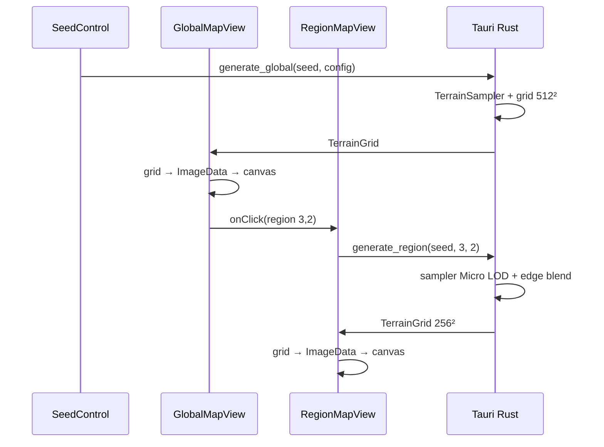

# Architektura mapy świata — Tauri + React (desktop)

Dokument opisuje architekturę **od zera** dla gry z mapą proceduralną. Efekt wizualny ma być zbliżony do [Procedural Map Generator](https://codesandbox.io/p/sandbox/procedural-map-generator-tsu2c) (Luca Tabone): ocean, plaże, lasy, góry, śnieg — ale w kontekście **globalnego świata**, w którym gracz może wejść w **lokalny, bardziej szczegółowy obszar**.

Stack: **Tauri 2 + React 19 + Vite + TypeScript**, `simplex-noise` już w projekcie. Backend Rust — szablon startowy.

---

## 1. Wymagania (potwierdzone)

| # | Wymaganie | Implikacja architektoniczna |
|---|-----------|----------------------------|
| 1 | Jedna **globalna mapa** + wejście w **lokalny, szczegółowy** obszar | Hierarchia LOD, współrzędne świata, spójność między poziomami |
| 2 | Faza 1: **elewacja + biomy + gradient kolorów** | Pipeline: fBm → kształt → redistribution → biome(e, m) → RGB |
| 3 | **Różne kształty** lądu (nie tylko jedna wyspa kwadratowa) | Wymienne profile falloff + opcjonalnie archipelagi |
| 4 | Teren **read-only** na razie; w przyszłości zmiany przez **eventy gry** | Warstwa bazowa (seed) + opcjonalna warstwa delt |
| 5 | **Tylko desktop** (Tauri) | Rust jako docelowe źródło prawdy; brak wariantu web |
| 6 | Faza 1 UI: **podgląd + seed** | Brak hover, pathfinding, placement |
| 7 | Tick symulacji | **Poza zakresem** — nie projektujemy IPC pod real-time |

---

## 2. Koncepcja: dwa poziomy jednego świata

Gracz widzi **ten sam świat** na dwóch skalach. To nie są dwie niezależne mapy — to ten sam teren opisany ciągłymi współrzędnymi.

```
┌─────────────────────────────────────────────────────────────┐
│  POZIOM MAKRO (GlobalMap)                                   │
│  Cały świat, np. 512×512 komórek                            │
│  1 komórka ≈ 1 km (abstrakcyjnie)                           │
│  Mniej detali, szybki render, nawigacja strategiczna        │
└───────────────────────────┬─────────────────────────────────┘
                            │ gracz klika region (rx, ry)
                            ▼
┌─────────────────────────────────────────────────────────────┐
│  POZIOM MIKRO (RegionMap)                                   │
│  Fragment świata, np. 64×64 km renderowany jako 256×256 px  │
│  4× więcej pikseli na jednostkę świata = więcej detali      │
│  Ten sam seed + te same world coords w środku regionu       │
└─────────────────────────────────────────────────────────────┘
```

### Kluczowa zasada: `elevationAt(worldX, worldY)` — nie `elevationAt(tileX, tileY)`

Siatka to tylko ** próbkowanie** funkcji ciągłej. Globalna mapa i region to ten sam sampler, inna gęstość próbek i inny poziom szczegółowości (LOD).

```typescript
// Współrzędne świata — float, niezależne od rozdzielczości ekranu
elevationAt(worldX: number, worldY: number, lod: LodLevel): number
moistureAt(worldX: number, worldY: number, lod: LodLevel): number
```

**Dlaczego tak:**
- Wejście w region nie „teleportuje" do innego świata — środek regionu ma tę samą elewację co na mapie globalnej.
- Powiększenie dodaje **szczegół**, nie zmienia kontynentu.
- Chunki, zapis i pathfinding mogą używać tych samych world coords.

---

## 3. Pipeline terenu (efekt jak CodeSandbox)

```
worldX, worldY, lod
        │
        ▼
┌───────────────────┐
│ fBm elevation     │  4–6 oktaw simplex, persistence, lacunarity
└─────────┬─────────┘
          │
          ▼
┌───────────────────┐
│ Shape falloff     │  radial / ellipse / square / irregular / archipelago
└─────────┬─────────┘
          │
          ▼
┌───────────────────┐
│ Redistribution    │  pow(e × fudge, exponent) — płaskie doliny, ostre góry
└─────────┬─────────┘
          │
          ▼
┌───────────────────┐     ┌───────────────────┐
│ macro elevation   │  +  │ detail fBm (LOD)  │  tylko przy lod = Micro
└─────────┬─────────┘     └─────────┬─────────┘
          └───────────┬─────────────┘
                      ▼
              elevation ∈ [0, 1]
                      │
        ┌─────────────┴─────────────┐
        ▼                           ▼
  fBm moisture              biome(elevation, moisture)
  (osobny seed)                      │
                                     ▼
                              kolor / TileType
```

### Elementy pipeline'u

| Krok | Rola | Bez tego |
|------|------|----------|
| fBm elevation | Wysokość bazowa | Losowy szum bez struktury |
| Shape falloff | Kształt lądu / wyspy | Kontynent na całą mapę |
| Redistribution | Kontrast reliefu | Miękkie, „papierowe" góry |
| Detail fBm (micro) | Drobniejszy relief w regionie | Zoom = tylko powiększenie pikseli |
| fBm moisture (osobny seed) | Trawa vs las vs jałowiec | Pionowe pasy kolorów |
| biome(e, m) | Typ terenu | Tylko gradient wysokości |

---

## 4. Różne kształty lądu (ShapeProfile)

Jeden parametr `islandMix` nie wystarczy — potrzebujesz **profili kształtu**, wybieranych per świat (z seeda) lub z konfiguracji.

```typescript
enum ShapeProfile {
  Radial,       // okrągła wyspa — falloff od środka
  Ellipse,      // elipsa (aspect ratio z seeda)
  SquareBump,   // jak redblobgames — kwadrat wypełniony wyspaną
  Irregular,    // falloff modulowany szumem → zatoki, półwyspy
  Archipelago,  // kilka centrów falloff z seeda → wiele wysp
}
```

### Jak działa Irregular

```typescript
const baseFalloff = radialDistance(worldX, worldY, center);
const coastNoise = fbm(noise2D, worldX, worldY, 3, ...) * coastAmplitude;
const effectiveFalloff = baseFalloff + coastNoise; // brzegi „rozejechane"
elevation = lerp(rawElevation, 1 - effectiveFalloff, islandMix);
```

### Jak działa Archipelago

```typescript
// z seeda wylosuj N centrów (deterministycznie)
const falloffs = centers.map(c => radialDistance(worldX, worldY, c));
const combined = Math.max(...falloffs); // unia wysp
```

**Wybór profilu z seeda:** `hash(seed) % profiles.length` — ten sam seed = ten sam kształt świata, różne seedy = różne kształty bez ręcznej konfiguracji.

---

## 5. LOD — makro vs mikro

```typescript
enum LodLevel {
  Macro,  // mapa globalna
  Micro,  // region po wejściu gracza
}

interface LodParams {
  octaves: number;
  detailOctaves: number;   // dodatkowe oktawy tylko dla Micro
  detailStrength: number;  // 0 = brak dodatkowego detalu
}
```

### Elewacja wielopoziomowa

```typescript
function elevationAt(worldX: number, worldY: number, lod: LodLevel): number {
  const macro = elevationPipeline(worldX, worldY, MACRO_PARAMS);

  if (lod === LodLevel.Macro) {
    return macro;
  }

  // Micro: macro + wysokoczęstotliwościowy detail (nie zmienia średniej na brzegu regionu)
  const detail = fbm(detailNoise, worldX * detailScale, worldY * detailScale, ...);
  const blend = regionEdgeBlend(worldX, worldY, regionBounds); // 0 na krawędzi, 1 w środku
  return clamp01(macro + detail * detailStrength * blend);
}
```

**`regionEdgeBlend`** — funkcja która tłumi detail noise na granicy regionu, żeby sąsiednie regiony nie miały widocznego „szwu". Detail jest dodawany głównie w centrum regionu gracza.

### Region — definicja

```typescript
interface RegionId {
  rx: number;  // indeks regionu na siatce makro
  ry: number;
}

interface RegionBounds {
  worldX0: number;
  worldY0: number;
  worldX1: number;
  worldY1: number;
}

// Np. świat 512×512, region 64×64 world units → 8×8 regionów
function regionBounds(id: RegionId, worldSize: number, regionSize: number): RegionBounds
```

Gracz na mapie globalnej klika `(rx, ry)` → aplikacja generuje `RegionMap` dla `regionBounds(rx, ry)` w rozdzielczości np. 256×256 px.

---

## 6. Biomy i kolory (faza 1)

### Typy terenu

```typescript
enum TileType {
  DeepWater = 0,
  Water = 1,
  Sand = 2,
  Grass = 3,
  Forest = 4,
  Mountain = 5,
  Snow = 6,
}
```

### biome(elevation, moisture)

Progi jak w referencji CodeSandbox / redblobgames — macierz decyzji, nie tylko `if elevation > 0.7`:

```
e < 0.35        → DeepWater / Water (zależnie od progu)
0.35 ≤ e < 0.40 → Sand (plaża)
e ≥ 0.40, m < 0.3 → Grass (suche niziny)
e ≥ 0.40, m ≥ 0.3 → Forest
e ≥ 0.70        → Mountain
e ≥ 0.85        → Snow
```

**Osobny seed wilgotności:** `createNoise2D(seed("world-seed:moisture"))` — obowiązkowe, inaczej las i trawa tworzą pasma równoległe do gradientu wysokości.

### Kolory — gradient w obrębie progu (opcjonalnie)

Faza 1 może używać **stałych kolorów per TileType** (jak referencja — ostre piksele). Później: interpolacja elevation w obrębie Mountain → subtelny gradient stoków.

---

## 7. Warstwa modyfikacji terenu (przyszłe eventy)

Teraz: teren w 100% z seeda. W przyszłości: eventy gry (powódź, wulkan, osuwisko) mogą zmieniać lokalny teren.

```
┌─────────────────────────────────────┐
│  TerrainDelta[]  (opcjonalna)       │  ← eventy gry, serializowane
│  nadpisuje effective wartości       │
└──────────────────┬──────────────────┘
                   │ apply on read
┌──────────────────▼──────────────────┐
│  BaseTerrain (seed, immutable)      │  ← zawsze odtwarzalna z seeda
│  elevationAt / moistureAt / biome   │
└─────────────────────────────────────┘
```

```typescript
interface TerrainDelta {
  worldX: number;
  worldY: number;
  elevationOverride?: number;
  biomeOverride?: TileType;
  sourceEventId: string;  // "flood-1842", "volcano-7"
}

function effectiveElevation(x: number, y: number, deltas: TerrainDelta[]): number {
  const base = elevationAt(x, y, lod);
  const hit = deltas.find(d => d.worldX === x && d.worldY === y);
  return hit?.elevationOverride ?? base;
}
```

**Dlaczego warstwa delt, a nie mutacja seeda:**
- Seed pozostaje źródłem prawdy dla 99% mapy.
- Zapis gry: `seed + deltas + features` — lekkie, audytowalne.
- Można cofnąć event (usunąć deltę).
- Faza 1: `TerrainDelta[]` = pusta tablica, API gotowe.

---

## 8. Architektura systemu (Tauri desktop)

```
┌──────────────────────────────────────────────────────────────┐
│  REACT — prezentacja                                         │
│  GlobalMapView │ RegionMapView │ SeedControl                 │
│  (canvas ImageData, zero logiki szumu)                        │
└────────────────────────────┬─────────────────────────────────┘
                             │ invoke / listen
┌────────────────────────────▼─────────────────────────────────┐
│  TAURI — Rust (źródło prawdy)                                │
│  WorldState                                                  │
│  ├─ WorldConfig (seed, shape, rozmiary)                      │
│  ├─ TerrainSampler (elevationAt, moistureAt, biomeAt)        │
│  ├─ generate_global_grid() → Vec<TerrainCell>              │
│  ├─ generate_region_grid(RegionId) → Vec<TerrainCell>      │
│  └─ terrain_deltas: Vec<TerrainDelta>  (pusta w fazie 1)    │
└──────────────────────────────────────────────────────────────┘
```

### Dlaczego Rust od fazy 1 (skoro Tauri desktop only)?

| Powód | Wyjaśnienie |
|-------|-------------|
| Brak wariantu web | Nie potrzebujesz szybkiego prototypu w Workerze „na wszelki wypadek" |
| Hierarchia LOD | Spójność macro/micro w jednym module — trudniejsza do utrzymania w TS + Rust |
| Przyszłe eventy terenu | Delt y i features naturalnie żyją w `WorldState` |
| Jeden algorytm | Brak ryzyka desync między prototypem TS a grą |
| Wydajność | `rayon` na generacji regionu 256×256; brak kosztownego IPC przy każdym pikselu — tylko gotowa siatka |

**Faza 1 nie wymaga jeszcze pełnej gry** — wystarczą 2 komendy Tauri: `generate_global` i `generate_region`.

### IPC — co wysyłać

```typescript
// Request
invoke("generate_global", { seed: "eons-1", width: 512, height: 512 })
invoke("generate_region", { seed: "eons-1", region: { rx: 3, ry: 2 }, resolution: 256 })

// Response — gotowa siatka do renderu (nie surowy Float32Array jeśli nie potrzebny)
interface TerrainCell {
  elevation: number;
  moisture: number;
  biome: TileType;
}
interface TerrainGrid {
  width: number;
  height: number;
  cells: TerrainCell[];  // row-major
}
```

Przy 512×512 = 262k komórek × ~12 bajtów ≈ 3 MB JSON — akceptowalne **jednorazowo** przy generacji. Dla optymalizacji później: bincode / współdzielony bufor / kompresja.

React konwertuje `TerrainGrid` → `ImageData` (kolory z `TileType`) i robi `putImageData`.

---

## 9. Pełna lista plików i ścieżek

Katalog projektu: `map_tests/` (root repozytorium).

### Pliki do utworzenia (nowe)

| # | Ścieżka | Odpowiedzialność |
|---|---------|------------------|
| R1 | `src-tauri/src/world/mod.rs` | Moduł `world`, re-eksporty |
| R2 | `src-tauri/src/world/types.rs` | `TileType`, `TerrainCell`, `TerrainGrid`, `RegionId` |
| R3 | `src-tauri/src/world/config.rs` | `WorldConfig`, `LodLevel`, `ShapeProfile`, domyślne wartości |
| R4 | `src-tauri/src/world/prng.rs` | Hash string seed → `u32` / `u64` |
| R5 | `src-tauri/src/world/noise.rs` | `fbm`, normalizacja szumu |
| R6 | `src-tauri/src/world/shape.rs` | Profile falloff (Radial, Ellipse, SquareBump, Irregular, Archipelago) |
| R7 | `src-tauri/src/world/biome.rs` | `biome(elevation, moisture) → TileType` |
| R8 | `src-tauri/src/world/sampler.rs` | `TerrainSampler` — `elevation_at`, `moisture_at` |
| R9 | `src-tauri/src/world/grid.rs` | `generate_global_grid`, `generate_region_grid` |
| R10 | `src-tauri/src/world/delta.rs` | `TerrainDelta` — stub fazy 1 |
| F1 | `src/api/world.ts` | Typy TS + `invoke` wrappers |
| F2 | `src/map/colors.ts` | `TileType → RGB` |
| F3 | `src/map/render.ts` | `terrainGridToImageData()` |
| F4 | `src/hooks/useWorldMap.ts` | Hook globalnej mapy |
| F5 | `src/hooks/useRegionMap.ts` | Hook mapy regionu |
| F6 | `src/components/SeedControl.tsx` | Input seed + Regenerate |
| F7 | `src/components/GlobalMapView.tsx` | Canvas mapy globalnej + klik regionu |
| F8 | `src/components/RegionMapView.tsx` | Canvas regionu + Back |
| F9 | `src/components/MapScreen.css` | Style canvas (pixelated) |

### Pliki do edycji (istniejące)

| Ścieżka | Zmiana |
|---------|--------|
| `src-tauri/Cargo.toml` | Dodaj `noise`, `rayon` |
| `src-tauri/src/lib.rs` | Moduł `world`, `WorldState`, commands Tauri |
| `src/App.tsx` | Zastąp szablon — `SeedControl`, `GlobalMapView`, `RegionMapView` |
| `src/App.css` | Layout ekranu mapy |

### Pliki bez zmian (faza 1)

| Ścieżka | Uwaga |
|---------|-------|
| `src/main.tsx` | Entry point React — OK |
| `src/vite-env.d.ts` | Typy Vite — OK |
| `src-tauri/src/main.rs` | Wywołuje `map_tests_lib::run()` — OK |
| `src-tauri/tauri.conf.json` | Konfiguracja Tauri — OK |
| `package.json` | Bez nowych zależności (invoke już jest) |

### Drzewo katalogów po implementacji

```
map_tests/
├── map2.md                          ← ten dokument
├── package.json
├── src/
│   ├── api/
│   │   └── world.ts                 ← F1
│   ├── map/
│   │   ├── colors.ts                ← F2
│   │   └── render.ts                ← F3
│   ├── hooks/
│   │   ├── useWorldMap.ts           ← F4
│   │   └── useRegionMap.ts          ← F5
│   ├── components/
│   │   ├── SeedControl.tsx          ← F6
│   │   ├── GlobalMapView.tsx        ← F7
│   │   ├── RegionMapView.tsx        ← F8
│   │   └── MapScreen.css            ← F9
│   ├── App.tsx                      ← edycja
│   ├── App.css                      ← edycja
│   └── main.tsx
└── src-tauri/
    ├── Cargo.toml                   ← edycja
    └── src/
        ├── lib.rs                   ← edycja
        ├── main.rs
        └── world/
            ├── mod.rs               ← R1
            ├── types.rs               ← R2
            ├── config.rs              ← R3
            ├── prng.rs                ← R4
            ├── noise.rs               ← R5
            ├── shape.rs               ← R6
            ├── biome.rs               ← R7
            ├── sampler.rs             ← R8
            ├── grid.rs                ← R9
            └── delta.rs               ← R10
```

**React nie zawiera logiki szumu** — tylko typy, kolory, render, `invoke`.

---

## 10. Model danych

### WorldConfig

```typescript
interface WorldConfig {
  seed: string;
  worldWidth: number;       // np. 512 (world units)
  worldHeight: number;
  regionSize: number;       // np. 64 world units per region
  macroResolution: number;  // px global map (= worldWidth typowo)
  microResolution: number;  // px region view, np. 256

  // Noise
  scale: number;
  octaves: number;
  persistence: number;
  lacunarity: number;
  islandMix: number;
  redistributionExponent: number;
  redistributionFudge: number;

  // LOD
  detailOctaves: number;
  detailStrength: number;

  // Shape — opcjonalnie override; domyślnie z seeda
  shapeProfile?: ShapeProfile;
}
```

### Domyślne wartości (punkt startowy)

```typescript
const DEFAULT_WORLD: WorldConfig = {
  seed: "eons-world-1",
  worldWidth: 512,
  worldHeight: 512,
  regionSize: 64,
  macroResolution: 512,
  microResolution: 256,
  scale: 1.8,
  octaves: 6,
  persistence: 0.5,
  lacunarity: 2.0,
  islandMix: 0.75,
  redistributionExponent: 2.2,
  redistributionFudge: 1.1,
  detailOctaves: 4,
  detailStrength: 0.08,
};
```

---

## 11. UI fazy 1

```
┌─────────────────────────────────────────────┐
│  Seed: [ eons-world-1    ]  [ Regenerate ]  │
├─────────────────────────────────────────────┤
│                                             │
│         GLOBAL MAP (512×512)                │
│         klik na region → wejście              │
│                                             │
├─────────────────────────────────────────────┤
│  ← Back to world    REGION (3, 2)           │
│         REGION MAP (256×256, więcej detali) │
└─────────────────────────────────────────────┘
```

Zachowanie:
1. Start → `generate_global(seed)` → render globalnej mapy.
2. Zmiana seeda → ponowna generacja globalnej.
3. Klik na region `(rx, ry)` → `generate_region(seed, rx, ry)` → render regionu.
4. „Back" → powrót do globalnej (cache w React, bez ponownego invoke jeśli seed się nie zmienił).

Brak: hover elevation, minimap, placement, symulacja czasu.

---

## 12. Determinizm i stabilność

```rust
// Rust — ten sam seed zawsze ten sam świat
let elev_noise = noise::SuperSimplex::new(seed_to_u32(&config.seed));
let moist_noise = noise::SuperSimplex::new(seed_to_u32(&format!("{}:moisture", config.seed)));
```

Checklist:
- [ ] String seed → deterministyczny hash → seed RNG / noise
- [ ] Osobny seed wilgotności
- [ ] Brak `rand::thread_rng()` bez seeda w pipeline terenu
- [ ] ShapeProfile z seeda (jeśli nie override)
- [ ] Test: `generate_global("test")` dwa razy → identyczny hash siatki
- [ ] Test: elewacja w `(worldX, worldY)` na macro = elewacja w tym samym punkcie na micro (bez detail blend)

---

## 13. Wydajność — cele

| Operacja | Rozmiar | Cel |
|----------|---------|-----|
| `generate_global` | 512×512 | < 200 ms |
| `generate_region` | 256×256 | < 80 ms |
| Render React | dowolny | < 16 ms (ImageData + putImageData) |

Optymalizacje (tylko gdy potrzeba):
1. `rayon` — równoległa pętla po wierszach w `grid.rs`
2. Cache regionu w `WorldState` — nie regeneruj po powrocie z tego samego seeda
3. Bincode zamiast JSON w IPC
4. `Uint32Array` kolorów z Rust (gotowe RGBA) — zero konwersji biome→color w JS

---

## 14. Przepływ danych (diagram)



---

## 15. Implementacja krok po kroku

Każdy krok kończy się **weryfikacją** — nie przechodź dalej, dopóki bieżący nie działa.

---

### Krok 0 — Zależności Rust

**Plik:** `src-tauri/Cargo.toml`

Dodaj do `[dependencies]`:

```toml
noise = "0.9"
rayon = "1"
```

**Weryfikacja:**

```bash
cd src-tauri && cargo check
```

---

### Krok 1 — Typy podstawowe

**Plik:** `src-tauri/src/world/types.rs`

```rust
use serde::{Deserialize, Serialize};

#[derive(Debug, Clone, Copy, PartialEq, Eq, Serialize, Deserialize)]
#[serde(rename_all = "PascalCase")]
pub enum TileType {
    DeepWater = 0,
    Water = 1,
    Sand = 2,
    Grass = 3,
    Forest = 4,
    Mountain = 5,
    Snow = 6,
}

#[derive(Debug, Clone, Serialize, Deserialize)]
pub struct TerrainCell {
    pub elevation: f32,
    pub moisture: f32,
    pub biome: TileType,
}

#[derive(Debug, Clone, Serialize, Deserialize)]
pub struct TerrainGrid {
    pub width: u32,
    pub height: u32,
    pub cells: Vec<TerrainCell>,
}

#[derive(Debug, Clone, Copy, Serialize, Deserialize)]
pub struct RegionId {
    pub rx: u32,
    pub ry: u32,
}

#[derive(Debug, Clone, Copy)]
pub struct RegionBounds {
    pub world_x0: f32,
    pub world_y0: f32,
    pub world_x1: f32,
    pub world_y1: f32,
}

impl RegionBounds {
    pub fn from_region(id: RegionId, region_size: u32) -> Self {
        let x0 = id.rx as f32 * region_size as f32;
        let y0 = id.ry as f32 * region_size as f32;
        Self {
            world_x0: x0,
            world_y0: y0,
            world_x1: x0 + region_size as f32,
            world_y1: y0 + region_size as f32,
        }
    }
}
```

**Plik:** `src-tauri/src/world/mod.rs`

```rust
pub mod biome;
pub mod config;
pub mod delta;
pub mod grid;
pub mod noise;
pub mod prng;
pub mod sampler;
pub mod shape;
pub mod types;

pub use config::{LodLevel, ShapeProfile, WorldConfig};
pub use grid::{generate_global_grid, generate_region_grid};
pub use types::{RegionId, TerrainGrid};
```

**Weryfikacja:** `cargo check` (po dodaniu pustych modułów lub od razu kolejnych kroków).

---

### Krok 2 — Konfiguracja świata

**Plik:** `src-tauri/src/world/config.rs`

```rust
use serde::{Deserialize, Serialize};

use crate::world::prng::hash_seed;

#[derive(Debug, Clone, Copy, PartialEq, Eq, Serialize, Deserialize)]
#[serde(rename_all = "PascalCase")]
pub enum LodLevel {
    Macro,
    Micro,
}

#[derive(Debug, Clone, Copy, PartialEq, Eq, Serialize, Deserialize)]
#[serde(rename_all = "PascalCase")]
pub enum ShapeProfile {
    Radial,
    Ellipse,
    SquareBump,
    Irregular,
    Archipelago,
}

impl ShapeProfile {
    pub fn from_index(i: u32) -> Self {
        match i % 5 {
            0 => Self::Radial,
            1 => Self::Ellipse,
            2 => Self::SquareBump,
            3 => Self::Irregular,
            _ => Self::Archipelago,
        }
    }
}

#[derive(Debug, Clone, Serialize, Deserialize)]
#[serde(rename_all = "camelCase")]
pub struct WorldConfig {
    pub seed: String,
    pub world_width: u32,
    pub world_height: u32,
    pub region_size: u32,
    pub macro_resolution: u32,
    pub micro_resolution: u32,
    pub scale: f32,
    pub octaves: u32,
    pub persistence: f32,
    pub lacunarity: f32,
    pub island_mix: f32,
    pub redistribution_exponent: f32,
    pub redistribution_fudge: f32,
    pub detail_octaves: u32,
    pub detail_strength: f32,
    pub shape_profile: Option<ShapeProfile>,
}

impl Default for WorldConfig {
    fn default() -> Self {
        Self {
            seed: "eons-world-1".into(),
            world_width: 512,
            world_height: 512,
            region_size: 64,
            macro_resolution: 512,
            micro_resolution: 256,
            scale: 1.8,
            octaves: 6,
            persistence: 0.5,
            lacunarity: 2.0,
            island_mix: 0.75,
            redistribution_exponent: 2.2,
            redistribution_fudge: 1.1,
            detail_octaves: 4,
            detail_strength: 0.08,
            shape_profile: None,
        }
    }
}

impl WorldConfig {
    pub fn with_seed(mut self, seed: impl Into<String>) -> Self {
        self.seed = seed.into();
        self
    }

    pub fn resolved_shape_profile(&self) -> ShapeProfile {
        self.shape_profile.unwrap_or_else(|| {
            let h = hash_seed(&self.seed);
            ShapeProfile::from_index((h % 5) as u32)
        })
    }
}
```

---

### Krok 3 — PRNG / hash seeda

**Plik:** `src-tauri/src/world/prng.rs`

```rust
/// Deterministyczny hash stringa → u32 (ten sam seed = ten sam świat)
pub fn hash_seed(seed: &str) -> u32 {
    let mut state: u32 = 0;
    for byte in seed.bytes() {
        state = state.wrapping_mul(31).wrapping_add(byte as u32);
    }
    state
}

pub fn hash_seed_u64(seed: &str) -> u64 {
    let a = hash_seed(seed) as u64;
    let b = hash_seed(&format!("{seed}:b")) as u64;
    (a << 32) | b
}
```

---

### Krok 4 — fBm (szum wielooktawowy)

**Plik:** `src-tauri/src/world/noise.rs`

```rust
use noise::{NoiseFn, SuperSimplex};

/// Normalizacja z [-1, 1] do [0, 1]
pub fn to_01(v: f64) -> f64 {
    v * 0.5 + 0.5
}

/// fBm — suma oktaw simplex noise
pub fn fbm(
    noise: &SuperSimplex,
    x: f64,
    y: f64,
    octaves: u32,
    persistence: f64,
    lacunarity: f64,
) -> f64 {
    let mut amplitude = 1.0;
    let mut frequency = 1.0;
    let mut value = 0.0;
    let mut max_value = 0.0;

    for _ in 0..octaves {
        value += to_01(noise.get([x * frequency, y * frequency])) * amplitude;
        max_value += amplitude;
        amplitude *= persistence;
        frequency *= lacunarity;
    }

    if max_value == 0.0 {
        0.0
    } else {
        value / max_value
    }
}

pub fn clamp01(v: f64) -> f64 {
    v.clamp(0.0, 1.0)
}

pub fn lerp(a: f64, b: f64, t: f64) -> f64 {
    a + (b - a) * t
}

pub fn redistribute(elevation: f64, exponent: f64, fudge: f64) -> f64 {
    let e = clamp01(elevation * fudge);
    e.powf(exponent)
}
```

---

### Krok 5 — Profile kształtu lądu

**Plik:** `src-tauri/src/world/shape.rs`

```rust
use noise::{NoiseFn, SuperSimplex};

use crate::world::config::{ShapeProfile, WorldConfig};
use crate::world::noise::{fbm, lerp};
use crate::world::prng::{hash_seed, hash_seed_u64};

/// Wartość kształtu: 1 = środek lądu, 0 = krawędź / ocean
pub fn shape_value(
    profile: ShapeProfile,
    world_x: f64,
    world_y: f64,
    config: &WorldConfig,
    coast_noise: &SuperSimplex,
) -> f64 {
    let w = config.world_width as f64;
    let h = config.world_height as f64;
    let cx = w * 0.5;
    let cy = h * 0.5;

    match profile {
        ShapeProfile::Radial => {
            let dx = (world_x - cx) / (w * 0.5);
            let dy = (world_y - cy) / (h * 0.5);
            let d = (dx * dx + dy * dy).sqrt();
            (1.0 - d).clamp(0.0, 1.0)
        }
        ShapeProfile::Ellipse => {
            let seed_h = hash_seed(&config.seed) as f64;
            let aspect = 0.6 + (seed_h % 100) as f64 / 100.0 * 0.8; // 0.6–1.4
            let dx = (world_x - cx) / (w * 0.5);
            let dy = (world_y - cy) / (h * 0.5 * aspect);
            let d = (dx * dx + dy * dy).sqrt();
            (1.0 - d).clamp(0.0, 1.0)
        }
        ShapeProfile::SquareBump => {
            let nx = (2.0 * world_x) / w - 1.0;
            let ny = (2.0 * world_y) / h - 1.0;
            1.0 - (1.0 - nx * nx) * (1.0 - ny * ny)
        }
        ShapeProfile::Irregular => {
            let dx = (world_x - cx) / (w * 0.5);
            let dy = (world_y - cy) / (h * 0.5);
            let base = (1.0 - (dx * dx + dy * dy).sqrt()).clamp(0.0, 1.0);
            let coast = fbm(coast_noise, world_x * 0.02, world_y * 0.02, 3, 0.5, 2.0);
            (base + (coast - 0.5) * 0.35).clamp(0.0, 1.0)
        }
        ShapeProfile::Archipelago => {
            let n = 3 + (hash_seed(&format!("{}:arch", config.seed)) % 4) as usize;
            let mut max_shape = 0.0_f64;
            for i in 0..n {
                let h64 = hash_seed_u64(&format!("{}:island:{i}", config.seed));
                let ix = (h64 % config.world_width as u64) as f64;
                let iy = ((h64 >> 32) % config.world_height as u64) as f64;
                let dx = (world_x - ix) / (config.region_size as f64 * 0.8);
                let dy = (world_y - iy) / (config.region_size as f64 * 0.8);
                let d = (dx * dx + dy * dy).sqrt();
                max_shape = max_shape.max((1.0 - d).clamp(0.0, 1.0));
            }
            max_shape
        }
    }
}

/// Mieszanka surowej elewacji z kształtem wyspy
pub fn apply_shape(raw_elevation: f64, shape: f64, island_mix: f64) -> f64 {
    lerp(raw_elevation, shape, island_mix as f64)
}
```

---

### Krok 6 — Biomy

**Plik:** `src-tauri/src/world/biome.rs`

```rust
use crate::world::types::TileType;

pub fn biome(elevation: f32, moisture: f32) -> TileType {
    if elevation < 0.30 {
        return TileType::DeepWater;
    }
    if elevation < 0.35 {
        return TileType::Water;
    }
    if elevation < 0.40 {
        return TileType::Sand;
    }
    if elevation >= 0.85 {
        return TileType::Snow;
    }
    if elevation >= 0.70 {
        return TileType::Mountain;
    }
    if moisture >= 0.30 {
        TileType::Forest
    } else {
        TileType::Grass
    }
}
```

---

### Krok 7 — TerrainSampler (serce systemu)

**Plik:** `src-tauri/src/world/sampler.rs`

```rust
use noise::SuperSimplex;

use crate::world::biome::biome;
use crate::world::config::{LodLevel, WorldConfig};
use crate::world::noise::{fbm, redistribute, clamp01};
use crate::world::prng::hash_seed;
use crate::world::shape::{apply_shape, shape_value};
use crate::world::types::{RegionBounds, TerrainCell, TileType};

pub struct TerrainSampler {
    config: WorldConfig,
    elev_noise: SuperSimplex,
    moist_noise: SuperSimplex,
    detail_noise: SuperSimplex,
    coast_noise: SuperSimplex,
}

impl TerrainSampler {
    pub fn new(config: WorldConfig) -> Self {
        let elev_seed = hash_seed(&config.seed);
        let moist_seed = hash_seed(&format!("{}:moisture", config.seed));
        let detail_seed = hash_seed(&format!("{}:detail", config.seed));
        let coast_seed = hash_seed(&format!("{}:coast", config.seed));

        Self {
            config,
            elev_noise: SuperSimplex::new(elev_seed),
            moist_noise: SuperSimplex::new(moist_seed),
            detail_noise: SuperSimplex::new(detail_seed),
            coast_noise: SuperSimplex::new(coast_seed),
        }
    }

    pub fn elevation_at(&self, world_x: f64, world_y: f64, lod: LodLevel) -> f32 {
        let c = &self.config;
        let wx = (world_x / c.world_width as f64) * c.scale as f64;
        let wy = (world_y / c.world_height as f64) * c.scale as f64;

        let raw = fbm(
            &self.elev_noise,
            wx,
            wy,
            c.octaves,
            c.persistence as f64,
            c.lacunarity as f64,
        );

        let profile = c.resolved_shape_profile();
        let shape = shape_value(profile, world_x, world_y, c, &self.coast_noise);
        let shaped = apply_shape(raw, shape, c.island_mix);
        let mut e = redistribute(
            shaped,
            c.redistribution_exponent as f64,
            c.redistribution_fudge as f64,
        );

        if lod == LodLevel::Micro {
            let detail = fbm(
                &self.detail_noise,
                world_x * 0.15,
                world_y * 0.15,
                c.detail_octaves,
                0.5,
                2.0,
            );
            e += (detail - 0.5) * c.detail_strength as f64;
        }

        clamp01(e) as f32
    }

    pub fn moisture_at(&self, world_x: f64, world_y: f64) -> f32 {
        let c = &self.config;
        let wx = (world_x / c.world_width as f64) * c.scale as f64;
        let wy = (world_y / c.world_height as f64) * c.scale as f64;
        fbm(
            &self.moist_noise,
            wx,
            wy,
            c.octaves,
            c.persistence as f64,
            c.lacunarity as f64,
        ) as f32
    }

    pub fn cell_at(&self, world_x: f64, world_y: f64, lod: LodLevel) -> TerrainCell {
        let elevation = self.elevation_at(world_x, world_y, lod);
        let moisture = self.moisture_at(world_x, world_y);
        let biome_type = biome(elevation, moisture);
        TerrainCell {
            elevation,
            moisture,
            biome: biome_type,
        }
    }

    /// Tłumi detail noise na krawędzi regionu (0 = brzeg, 1 = środek)
    pub fn region_edge_blend(&self, world_x: f64, world_y: f64, bounds: RegionBounds) -> f32 {
        let margin = (self.config.region_size as f64 * 0.15).max(4.0);
        let dx = (world_x - bounds.world_x0)
            .min(bounds.world_x1 - world_x)
            .min(margin);
        let dy = (world_y - bounds.world_y0)
            .min(bounds.world_y1 - world_y)
            .min(margin);
        let d = dx.min(dy);
        (d / margin).clamp(0.0, 1.0) as f32
    }

    /// Elewacja micro z blendem na brzegu regionu
    pub fn elevation_at_region(
        &self,
        world_x: f64,
        world_y: f64,
        bounds: RegionBounds,
    ) -> f32 {
        let macro_e = self.elevation_at(world_x, world_y, LodLevel::Macro);
        let micro_e = self.elevation_at(world_x, world_y, LodLevel::Micro);
        let blend = self.region_edge_blend(world_x, world_y, bounds);
        macro_e + (micro_e - macro_e) * blend
    }

    pub fn cell_at_region(&self, world_x: f64, world_y: f64, bounds: RegionBounds) -> TerrainCell {
        let elevation = self.elevation_at_region(world_x, world_y, bounds);
        let moisture = self.moisture_at(world_x, world_y);
        TerrainCell {
            elevation,
            moisture,
            biome: biome(elevation, moisture),
        }
    }
}
```

**Weryfikacja (test w `sampler.rs` lub osobnym pliku):**

```rust
#[cfg(test)]
mod tests {
    use super::*;
    use crate::world::config::WorldConfig;

    #[test]
    fn same_seed_same_elevation() {
        let c = WorldConfig::default().with_seed("test-1");
        let a = TerrainSampler::new(c.clone());
        let b = TerrainSampler::new(c);
        let e1 = a.elevation_at(100.0, 200.0, LodLevel::Macro);
        let e2 = b.elevation_at(100.0, 200.0, LodLevel::Macro);
        assert_eq!(e1, e2);
    }
}
```

```bash
cd src-tauri && cargo test
```

---

### Krok 8 — Generacja siatek (global + region)

**Plik:** `src-tauri/src/world/grid.rs`

```rust
use rayon::prelude::*;

use crate::world::config::{LodLevel, WorldConfig};
use crate::world::sampler::TerrainSampler;
use crate::world::types::{RegionBounds, RegionId, TerrainCell, TerrainGrid};

pub fn generate_global_grid(config: WorldConfig) -> TerrainGrid {
    let sampler = TerrainSampler::new(config.clone());
    let width = config.macro_resolution;
    let height = config.macro_resolution;
    let world_w = config.world_width as f64;
    let world_h = config.world_height as f64;

    let rows: Vec<Vec<TerrainCell>> = (0..height)
        .into_par_iter()
        .map(|y| {
            (0..width)
                .map(|x| {
                    let world_x = (x as f64 + 0.5) / width as f64 * world_w;
                    let world_y = (y as f64 + 0.5) / height as f64 * world_h;
                    sampler.cell_at(world_x, world_y, LodLevel::Macro)
                })
                .collect()
        })
        .collect();

    let cells: Vec<TerrainCell> = rows.into_iter().flatten().collect();

    TerrainGrid {
        width,
        height,
        cells,
    }
}

pub fn generate_region_grid(config: WorldConfig, region: RegionId) -> TerrainGrid {
    let sampler = TerrainSampler::new(config.clone());
    let bounds = RegionBounds::from_region(region, config.region_size);
    let width = config.micro_resolution;
    let height = config.micro_resolution;
    let span_x = bounds.world_x1 - bounds.world_x0;
    let span_y = bounds.world_y1 - bounds.world_y0;

    let rows: Vec<Vec<TerrainCell>> = (0..height)
        .into_par_iter()
        .map(|y| {
            (0..width)
                .map(|x| {
                    let world_x =
                        bounds.world_x0 + (x as f64 + 0.5) / width as f64 * span_x;
                    let world_y =
                        bounds.world_y0 + (y as f64 + 0.5) / height as f64 * span_y;
                    sampler.cell_at_region(world_x, world_y, bounds)
                })
                .collect()
        })
        .collect();

    let cells: Vec<TerrainCell> = rows.into_iter().flatten().collect();

    TerrainGrid {
        width,
        height,
        cells,
    }
}
```

---

### Krok 9 — TerrainDelta (stub)

**Plik:** `src-tauri/src/world/delta.rs`

```rust
use serde::{Deserialize, Serialize};

use crate::world::types::TileType;

#[derive(Debug, Clone, Serialize, Deserialize)]
#[serde(rename_all = "camelCase")]
pub struct TerrainDelta {
    pub world_x: u32,
    pub world_y: u32,
    pub elevation_override: Option<f32>,
    pub biome_override: Option<TileType>,
    pub source_event_id: String,
}

/// Faza 1: pusta lista — API gotowe na eventy gry
pub fn apply_delta_elevation(base: f32, deltas: &[TerrainDelta], x: u32, y: u32) -> f32 {
    deltas
        .iter()
        .find(|d| d.world_x == x && d.world_y == y)
        .and_then(|d| d.elevation_override)
        .unwrap_or(base)
}
```

---

### Krok 10 — Tauri commands

**Plik:** `src-tauri/src/lib.rs` (zastąp całość)

```rust
mod world;

use std::sync::Mutex;
use tauri::State;
use world::config::WorldConfig;
use world::grid::{generate_global_grid, generate_region_grid};
use world::types::{RegionId, TerrainGrid};

struct WorldState {
    config: WorldConfig,
    global_cache: Option<TerrainGrid>,
}

impl Default for WorldState {
    fn default() -> Self {
        Self {
            config: WorldConfig::default(),
            global_cache: None,
        }
    }
}

#[tauri::command]
fn generate_global(state: State<'_, Mutex<WorldState>>, seed: String) -> TerrainGrid {
    let mut guard = state.lock().unwrap();
    guard.config.seed = seed;
    let grid = generate_global_grid(guard.config.clone());
    guard.global_cache = Some(grid.clone());
    grid
}

#[tauri::command]
fn generate_region(
    state: State<'_, Mutex<WorldState>>,
    seed: String,
    rx: u32,
    ry: u32,
) -> TerrainGrid {
    let guard = state.lock().unwrap();
    let mut config = guard.config.clone();
    config.seed = seed;
    generate_region_grid(config, RegionId { rx, ry })
}

#[cfg_attr(mobile, tauri::mobile_entry_point)]
pub fn run() {
    tauri::Builder::default()
        .plugin(tauri_plugin_opener::init())
        .manage(Mutex::new(WorldState::default()))
        .invoke_handler(tauri::generate_handler![generate_global, generate_region])
        .run(tauri::generate_context!())
        .expect("error while running tauri application");
}
```

**Weryfikacja:**

```bash
cd src-tauri && cargo build
pnpm tauri dev
```

W konsoli devtools (po kroku 12): `invoke('generate_global', { seed: 'test' })` powinno zwrócić obiekt z `cells`.

---

### Krok 11 — API TypeScript

**Plik:** `src/api/world.ts`

```typescript
import { invoke } from "@tauri-apps/api/core";

export type TileType =
  | "DeepWater"
  | "Water"
  | "Sand"
  | "Grass"
  | "Forest"
  | "Mountain"
  | "Snow";

export interface TerrainCell {
  elevation: number;
  moisture: number;
  biome: TileType;
}

export interface TerrainGrid {
  width: number;
  height: number;
  cells: TerrainCell[];
}

export interface RegionId {
  rx: number;
  ry: number;
}

export const REGION_SIZE = 64;
export const MACRO_RESOLUTION = 512;

export function generateGlobal(seed: string): Promise<TerrainGrid> {
  return invoke<TerrainGrid>("generate_global", { seed });
}

export function generateRegion(
  seed: string,
  rx: number,
  ry: number,
): Promise<TerrainGrid> {
  return invoke<TerrainGrid>("generate_region", { seed, rx, ry });
}

/** Klik na canvas globalny → indeks regionu */
export function pixelToRegion(
  px: number,
  py: number,
  canvasSize: number,
): RegionId {
  const worldX = (px / canvasSize) * MACRO_RESOLUTION;
  const worldY = (py / canvasSize) * MACRO_RESOLUTION;
  return {
    rx: Math.floor(worldX / REGION_SIZE),
    ry: Math.floor(worldY / REGION_SIZE),
  };
}
```

---

### Krok 12 — Kolory i render

**Plik:** `src/map/colors.ts`

```typescript
import type { TileType } from "../api/world";

const RGB: Record<TileType, [number, number, number]> = {
  DeepWater: [0x1a, 0x3a, 0x5c],
  Water: [0x2b, 0x6c, 0xb0],
  Sand: [0xe8, 0xd5, 0xa3],
  Grass: [0x5a, 0xa4, 0x4a],
  Forest: [0x2d, 0x5a, 0x27],
  Mountain: [0x6b, 0x6b, 0x6b],
  Snow: [0xf0, 0xf0, 0xf5],
};

export function biomeToRgb(biome: TileType): [number, number, number] {
  return RGB[biome];
}
```

**Plik:** `src/map/render.ts`

```typescript
import type { TerrainGrid } from "../api/world";
import { biomeToRgb } from "./colors";

export function terrainGridToImageData(grid: TerrainGrid): ImageData {
  const { width, height, cells } = grid;
  const pixels = new Uint8ClampedArray(width * height * 4);

  for (let i = 0; i < cells.length; i++) {
    const [r, g, b] = biomeToRgb(cells[i].biome);
    const o = i * 4;
    pixels[o] = r;
    pixels[o + 1] = g;
    pixels[o + 2] = b;
    pixels[o + 3] = 255;
  }

  return new ImageData(pixels, width, height);
}
```

---

### Krok 13 — Hooki React

**Plik:** `src/hooks/useWorldMap.ts`

```typescript
import { useCallback, useEffect, useState } from "react";
import { generateGlobal, type TerrainGrid } from "../api/world";

export function useWorldMap(seed: string) {
  const [grid, setGrid] = useState<TerrainGrid | null>(null);
  const [loading, setLoading] = useState(false);
  const [error, setError] = useState<string | null>(null);

  const reload = useCallback(async () => {
    setLoading(true);
    setError(null);
    try {
      const result = await generateGlobal(seed);
      setGrid(result);
    } catch (e) {
      setError(String(e));
    } finally {
      setLoading(false);
    }
  }, [seed]);

  useEffect(() => {
    reload();
  }, [reload]);

  return { grid, loading, error, reload };
}
```

**Plik:** `src/hooks/useRegionMap.ts`

```typescript
import { useCallback, useEffect, useState } from "react";
import { generateRegion, type RegionId, type TerrainGrid } from "../api/world";

export function useRegionMap(seed: string, region: RegionId | null) {
  const [grid, setGrid] = useState<TerrainGrid | null>(null);
  const [loading, setLoading] = useState(false);
  const [error, setError] = useState<string | null>(null);

  const reload = useCallback(async () => {
    if (!region) return;
    setLoading(true);
    setError(null);
    try {
      const result = await generateRegion(seed, region.rx, region.ry);
      setGrid(result);
    } catch (e) {
      setError(String(e));
    } finally {
      setLoading(false);
    }
  }, [seed, region]);

  useEffect(() => {
    reload();
  }, [reload]);

  return { grid, loading, error, reload };
}
```

---

### Krok 14 — Komponenty UI

**Plik:** `src/components/MapScreen.css`

```css
.map-canvas {
  image-rendering: pixelated;
  image-rendering: crisp-edges;
  border: 1px solid #333;
  cursor: crosshair;
  max-width: min(90vw, 512px);
  max-height: min(90vh, 512px);
  width: 100%;
  height: auto;
}

.map-screen {
  display: flex;
  flex-direction: column;
  align-items: center;
  gap: 1rem;
  padding: 1rem;
}

.map-loading {
  color: #888;
  font-size: 0.9rem;
}

.map-error {
  color: #c44;
}
```

**Plik:** `src/components/SeedControl.tsx`

```typescript
interface SeedControlProps {
  seed: string;
  onSeedChange: (seed: string) => void;
  onRegenerate: () => void;
  loading: boolean;
}

export function SeedControl({
  seed,
  onSeedChange,
  onRegenerate,
  loading,
}: SeedControlProps) {
  return (
    <div className="seed-control">
      <label>
        Seed:{" "}
        <input
          value={seed}
          onChange={(e) => onSeedChange(e.target.value)}
          placeholder="eons-world-1"
        />
      </label>
      <button type="button" onClick={onRegenerate} disabled={loading}>
        {loading ? "Generowanie…" : "Regenerate"}
      </button>
    </div>
  );
}
```

**Plik:** `src/components/GlobalMapView.tsx`

```typescript
import { useEffect, useRef } from "react";
import type { RegionId, TerrainGrid } from "../api/world";
import { MACRO_RESOLUTION, pixelToRegion } from "../api/world";
import { terrainGridToImageData } from "../map/render";

interface GlobalMapViewProps {
  grid: TerrainGrid | null;
  onRegionSelect: (region: RegionId) => void;
}

export function GlobalMapView({ grid, onRegionSelect }: GlobalMapViewProps) {
  const canvasRef = useRef<HTMLCanvasElement>(null);

  useEffect(() => {
    if (!grid || !canvasRef.current) return;
    const ctx = canvasRef.current.getContext("2d");
    if (!ctx) return;
    const imageData = terrainGridToImageData(grid);
    canvasRef.current.width = grid.width;
    canvasRef.current.height = grid.height;
    ctx.putImageData(imageData, 0, 0);
  }, [grid]);

  function handleClick(e: React.MouseEvent<HTMLCanvasElement>) {
    const canvas = canvasRef.current;
    if (!canvas) return;
    const rect = canvas.getBoundingClientRect();
    const px = ((e.clientX - rect.left) / rect.width) * canvas.width;
    const py = ((e.clientY - rect.top) / rect.height) * canvas.height;
    onRegionSelect(pixelToRegion(px, py, MACRO_RESOLUTION));
  }

  return (
    <canvas
      ref={canvasRef}
      className="map-canvas"
      onClick={handleClick}
      title="Kliknij region, aby powiększyć"
    />
  );
}
```

**Plik:** `src/components/RegionMapView.tsx`

```typescript
import { useEffect, useRef } from "react";
import type { RegionId, TerrainGrid } from "../api/world";
import { terrainGridToImageData } from "../map/render";

interface RegionMapViewProps {
  region: RegionId;
  grid: TerrainGrid | null;
  onBack: () => void;
}

export function RegionMapView({ region, grid, onBack }: RegionMapViewProps) {
  const canvasRef = useRef<HTMLCanvasElement>(null);

  useEffect(() => {
    if (!grid || !canvasRef.current) return;
    const ctx = canvasRef.current.getContext("2d");
    if (!ctx) return;
    const imageData = terrainGridToImageData(grid);
    canvasRef.current.width = grid.width;
    canvasRef.current.height = grid.height;
    ctx.putImageData(imageData, 0, 0);
  }, [grid]);

  return (
    <div>
      <button type="button" onClick={onBack}>
        ← Back to world
      </button>
      <p>
        Region ({region.rx}, {region.ry}) — więcej detali
      </p>
      <canvas ref={canvasRef} className="map-canvas" />
    </div>
  );
}
```

---

### Krok 15 — App.tsx (składanie całości)

**Plik:** `src/App.tsx`

```typescript
import { useState } from "react";
import type { RegionId } from "./api/world";
import { GlobalMapView } from "./components/GlobalMapView";
import { RegionMapView } from "./components/RegionMapView";
import { SeedControl } from "./components/SeedControl";
import { useRegionMap } from "./hooks/useRegionMap";
import { useWorldMap } from "./hooks/useWorldMap";
import "./components/MapScreen.css";
import "./App.css";

function App() {
  const [seed, setSeed] = useState("eons-world-1");
  const [draftSeed, setDraftSeed] = useState("eons-world-1");
  const [selectedRegion, setSelectedRegion] = useState<RegionId | null>(null);

  const { grid, loading, error, reload } = useWorldMap(seed);
  const regionMap = useRegionMap(seed, selectedRegion);

  function applySeed() {
    setSeed(draftSeed);
    setSelectedRegion(null);
  }

  return (
    <main className="map-screen">
      <h1>World Map Generator</h1>

      <SeedControl
        seed={draftSeed}
        onSeedChange={setDraftSeed}
        onRegenerate={applySeed}
        loading={loading || regionMap.loading}
      />

      {error && <p className="map-error">{error}</p>}
      {regionMap.error && <p className="map-error">{regionMap.error}</p>}
      {(loading || regionMap.loading) && (
        <p className="map-loading">Generowanie mapy…</p>
      )}

      {selectedRegion ? (
        <RegionMapView
          region={selectedRegion}
          grid={regionMap.grid}
          onBack={() => setSelectedRegion(null)}
        />
      ) : (
        <GlobalMapView grid={grid} onRegionSelect={setSelectedRegion} />
      )}
    </main>
  );
}

export default App;
```

**Plik:** `src/App.css` (minimalny layout)

```css
.seed-control {
  display: flex;
  gap: 0.75rem;
  align-items: center;
}

.seed-control input {
  min-width: 200px;
}
```

---

### Krok 16 — Uruchomienie i testy wizualne

```bash
# z katalogu map_tests/
pnpm tauri dev
```

**Checklist po uruchomieniu:**

| # | Akcja | Oczekiwany wynik |
|---|-------|------------------|
| 1 | Start aplikacji | Mapa globalna 512×512 z oceanem i lądem |
| 2 | Zmień seed → Regenerate | Inny kształt lądu / inny układ biomów |
| 3 | Ten sam seed ponownie | Identyczna mapa |
| 4 | Klik w ląd | Widok regionu 256×256 z większą ilością detali |
| 5 | Back to world | Powrót bez ponownego ładowania (cache hooka) |
| 6 | `cargo test` w src-tauri | Test determinizmu seeda przechodzi |

---

### Krok 17 — Kolejność tworzenia plików (skrót)

Jeśli implementujesz ręcznie, trzymaj się tej kolejności:

```
1.  src-tauri/Cargo.toml
2.  src-tauri/src/world/types.rs
3.  src-tauri/src/world/prng.rs
4.  src-tauri/src/world/noise.rs
5.  src-tauri/src/world/config.rs
6.  src-tauri/src/world/shape.rs
7.  src-tauri/src/world/biome.rs
8.  src-tauri/src/world/sampler.rs      → cargo test
9.  src-tauri/src/world/grid.rs
10. src-tauri/src/world/delta.rs
11. src-tauri/src/world/mod.rs
12. src-tauri/src/lib.rs                → cargo build
13. src/api/world.ts
14. src/map/colors.ts
15. src/map/render.ts
16. src/hooks/useWorldMap.ts
17. src/hooks/useRegionMap.ts
18. src/components/MapScreen.css
19. src/components/SeedControl.tsx
20. src/components/GlobalMapView.tsx
21. src/components/RegionMapView.tsx
22. src/App.tsx + src/App.css           → pnpm tauri dev
```

---

## 16. Zależności

```toml
# src-tauri/Cargo.toml
[dependencies]
tauri = { version = "2", features = [] }
serde = { version = "1", features = ["derive"] }
serde_json = "1"
noise = "0.9"
rayon = "1"
```

```json
// package.json — bez zmian, simplex-noise opcjonalnie do testów porównawczych TS vs Rust
```

---

## 17. Podsumowanie decyzji

| Pytanie | Decyzja |
|---------|---------|
| Jeden czy dwa światy? | **Jeden** — ciągłe world coords, dwa LOD |
| Gdzie logika szumu? | **Rust** (desktop only, od fazy 1) |
| Co robi React? | Render + seed + nawigacja macro→micro |
| Jak różne kształty? | **ShapeProfile** wybierany z seeda |
| Jak więcej detali w regionie? | Detail fBm + edge blend na LOD Micro |
| Zmiany terenu w przyszłości? | **TerrainDelta[]** nad bazą z seeda |
| Faza 1 UI? | Podgląd global + region + seed |
| IPC real-time? | **Nie teraz** — invoke przy generacji |

---

## 18. Następny krok

Postępuj według **sekcji 15** (kroki 0–17). Zacznij od `src-tauri/Cargo.toml`, potem pliki `src-tauri/src/world/*`, na końcu React (`src/api/`, `src/map/`, `src/hooks/`, `src/components/`, `src/App.tsx`).

Po kroku 16 uruchom `pnpm tauri dev` i przejdź checklistę wizualną.
